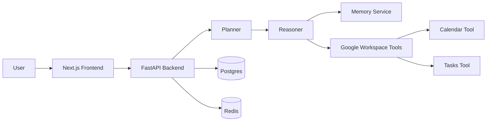
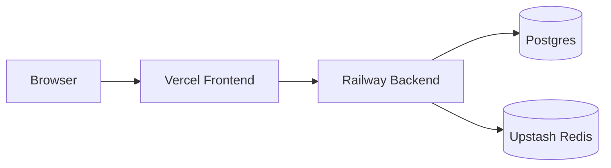

# MyDesk AI Architecture

## Component Diagram

## OAuth Flow

1. User clicks Connect Google Workspace.
2. Backend redirects to Google OAuth consent screen.
3. Google returns an authorization code.
4. Backend exchanges the code for refresh and access tokens.
5. Tokens are stored securely and used for Workspace API calls.

## Memory Flow

1. The agent captures recent conversation context.
2. The MemoryService stores user-specific notes and recent tool results.
3. Subsequent requests can reference this context to disambiguate follow-ups.

## Deployment Diagram

