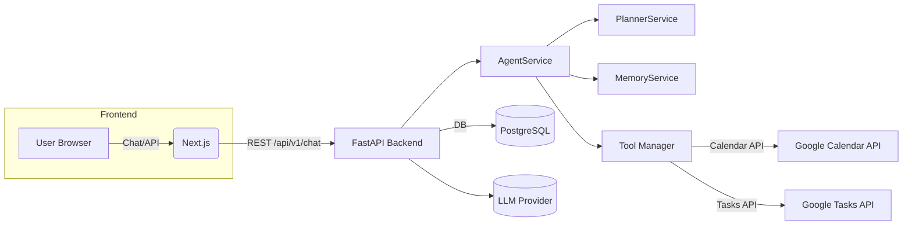
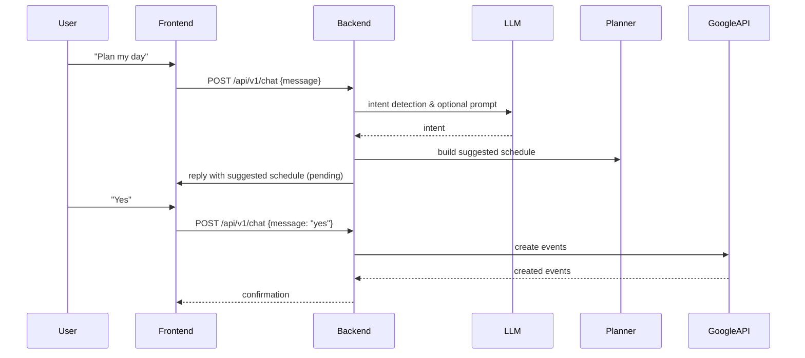
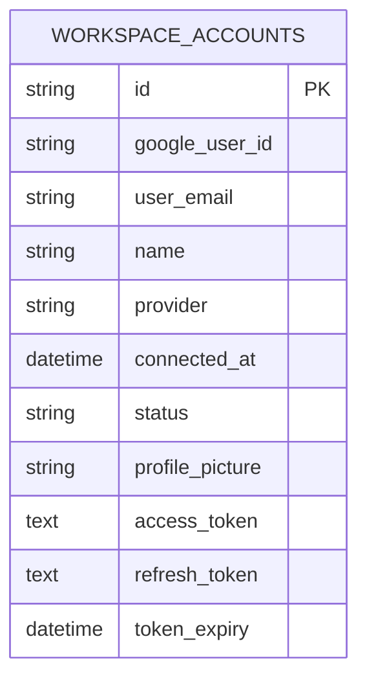

# MyDesk AI


MyDesk AI — a workspace-aware personal assistant that connects your Google Workspace (Calendar & Tasks) to an LLM-driven agent for planning, scheduling, and task automation.

Short description: A production-minded FastAPI + Next.js reference assistant that demonstrates OAuth-based Google Workspace integrations, stateful agent workflows, and extensible tool-calling architecture.

---

## Overview

Problem statement
- Modern knowledge workers use Google Calendar and Tasks, but need a smart assistant to synthesize, schedule, and automate routine workflows.

Why this project exists
- To provide a secure, extensible reference implementation that shows how to safely connect an LLM-driven assistant to a user's Google Workspace and orchestrate calendar/tasks automation without fabricating actions.

Main capabilities
- Multi-turn, stateful conversations driven by an `AgentService` (intent detection + pending workflows)
- Google OAuth (server-side PKCE flow) for Calendar & Tasks access
- Planner: generate suggested daily schedules and confirm before creating calendar events
- Task creation, listing, update, completion via Google Tasks API
- Frontend: Next.js chat UI with local persistence and assistant-result rendering

Real-world use cases
- "Plan my day" — read calendar + tasks, propose a schedule, ask once to add events
- "Add a task" — create tasks via chat or natural text
- "Schedule a meeting" — step-through prompts (title, time, duration) then create calendar event

---

## Key Features

### AI Assistant
- Multi-turn conversations with intent detection
- Context-awareness and per-user pending workflows (in-memory MemoryService)
- Persistent chat history in the frontend (localStorage)
- Tool calling: Calendar and Tasks as first-class tools

### Google Workspace
- OAuth PKCE flow for secure consent
- Google Calendar CRUD (events.insert, events.patch, events.delete, events.list)
- Google Tasks CRUD (tasks.insert, tasks.patch, tasks.delete, tasks.list)
- Planner that suggests schedules and asks user confirmation before mutating calendar

### Productivity
- Daily planning
- Task management (create, list, complete)
- Calendar management (create, list, update, delete)

### Engineering
- FastAPI backend (async) with SQLAlchemy + Alembic migrations
- Next.js (App Router) frontend with Tailwind CSS
- Docker + docker-compose for local development
- Structured logging and test coverage with pytest

---

## Architecture

High-level flow (simplified):



Sequence (AI workflow):



---

## Folder Structure

Top-level layout (important folders)

```
MyDesk-AI/
├─ backend/                 # FastAPI service, models, migrations, services
│  ├─ app/
│  │  ├─ api/routes/        # FastAPI route definitions (chat, oauth, calendar, tasks, auth, health)
│  │  ├─ models/            # SQLAlchemy models (WorkspaceAccount)
│  │  ├─ services/          # AgentService, Google tools, OAuth service, planner, memory
│  │  ├─ schemas/           # Pydantic schemas for API I/O
│  │  └─ core/              # config, database, logging
│  ├─ alembic/              # DB migrations
│  └─ requirements.txt
├─ frontend/                # Next.js 14 app (TypeScript, Tailwind)
│  ├─ src/app/              # pages (chat, calendar, tasks, connect-google)
│  └─ src/lib/api.ts        # frontend HTTP wrapper
├─ docker/                  # Dockerfiles for frontend and backend
├─ Dockerfile               # single-image convenience Dockerfile (backend)
└─ .github/                 # CI workflow + templates
```

Key files
- Backend: [backend/app/services/agent_service.py](backend/app/services/agent_service.py), [backend/app/services/google/oauth_service.py](backend/app/services/google/oauth_service.py), [backend/app/services/google/calendar_tool.py](backend/app/services/google/calendar_tool.py), [backend/app/services/google/tasks_tool.py](backend/app/services/google/tasks_tool.py)
- Frontend: [frontend/src/app/chat/page.tsx](frontend/src/app/chat/page.tsx), [frontend/src/lib/api.ts](frontend/src/lib/api.ts)

---

## Tech Stack

- Frontend: Next.js 14, React 18, TypeScript, Tailwind CSS
- Backend: Python 3.11+, FastAPI, SQLAlchemy (async), Alembic, pytest
- AI: Pluggable LLM provider adapter (Groq/OpenAI stubbed in `LLMProvider`)
- DB: PostgreSQL (asyncpg) for production; tests and docker-compose use SQLite defaults / file DB
- Auth: Google OAuth (PKCE) + JWT session tokens for frontend auth
- DevOps: Docker, docker-compose, GitHub Actions (CI)

---

## Installation

Prerequisites
- Python 3.11+
- Node 18+
- Docker & docker-compose (optional but recommended)

Clone

```bash
git clone https://github.com/your-org/your-repo.git
cd MyDesk-AI
```

Environment
- Copy backend/.env.example to backend/.env and fill values:

```bash
cp backend/.env.example backend/.env
# edit backend/.env and add GOOGLE_CLIENT_ID, GOOGLE_CLIENT_SECRET, JWT_SECRET, DATABASE_URL, etc.
```

Backend (local venv)

```bash
cd backend
python -m venv .venv
source .venv/bin/activate
pip install -r requirements.txt
# run migrations (Alembic)
alembic upgrade head
uvicorn app.main:app --reload --host 0.0.0.0 --port 8000
```

Frontend

```bash
cd frontend
npm install
npm run dev
```

Using Docker (recommended for parity)

```bash
docker compose -f docker/docker-compose.yml up --build
```

---

## Environment Variables

The backend loads settings from `backend/.env` (see `backend/.env.example`). Key variables:

| Variable | Required | Description |
|---|---:|---|
| `DATABASE_URL` | yes | SQLAlchemy DB URL (postgres:// or sqlite:/// for local) |
| `REDIS_URL` | no | Redis connection string (used for caching or future features) |
| `JWT_SECRET` | yes | Secret for signing session JWTs |
| `JWT_ALGORITHM` | no | Default HS256 |
| `CORS_ORIGINS` | no | Comma-separated origins for frontend |
| `FRONTEND_URL` | no | Frontend base URL (default http://localhost:3000) |
| `BACKEND_URL` | no | Backend base URL (default http://localhost:8000) |
| `LLM_PROVIDER` | no | Default LLM provider key (groq/openai) |
| `GROQ_API_KEY` | no | API key for Groq provider (if used) |
| `GOOGLE_CLIENT_ID` | yes (for live Google features) | OAuth client id |
| `GOOGLE_CLIENT_SECRET` | yes (for live Google features) | OAuth client secret |
| `GOOGLE_REDIRECT_URI` | yes (for OAuth) | Redirect URI, e.g. http://localhost:8000/api/v1/oauth/google/callback |

Security note: keep `JWT_SECRET`, `GOOGLE_CLIENT_SECRET`, and LLM API keys out of source control.

---

## Google OAuth Setup

1. Create a Google Cloud project and configure OAuth Consent Screen (external/internal depending on your use).
2. Create OAuth 2.0 Client Credentials (Web application). Add `GOOGLE_REDIRECT_URI` to redirect URIs (e.g., `http://localhost:8000/api/v1/oauth/google/callback`).
3. Add `GOOGLE_CLIENT_ID` and `GOOGLE_CLIENT_SECRET` to `backend/.env`.
4. Scopes used by the app:
	 - `openid`, `userinfo.email`, `userinfo.profile`
	 - `https://www.googleapis.com/auth/calendar.events`
	 - `https://www.googleapis.com/auth/tasks`

Production: use HTTPS redirect URIs and restrict OAuth client to authorized domains.

---

## API Documentation

Base path: `/api/v1`

Authentication: endpoints that operate on a user require a bearer JWT token created by the OAuth callback and stored in frontend localStorage under `mydesk-auth-token`.

Endpoints (core)

- `GET /api/v1/health` — service health
- `POST /api/v1/chat` — Chat endpoint
	- Request: `{ "message": "Plan my day" }`
	- Response: `{ "reply": string, "intent": string, "result": object | null }`
- `GET /api/v1/oauth/google` — start OAuth (returns an authorization URL)
- `GET /api/v1/oauth/google/callback` — OAuth callback (exchanges code -> issues JWT)
- `GET /api/v1/oauth/google/status` — check configured/connected

- `GET /api/v1/calendar` — list calendar events (requires auth)
- `POST /api/v1/calendar` — create an event (requires auth)
- `PUT /api/v1/calendar/{event_id}` — update event
- `DELETE /api/v1/calendar/{event_id}` — delete event

- `GET /api/v1/tasks` — list tasks
- `POST /api/v1/tasks` — create task
- `PUT /api/v1/tasks/{task_id}` — update task
- `DELETE /api/v1/tasks/{task_id}` — delete task

Examples

Fetch chat reply (curl):

```bash
curl -X POST "http://localhost:8000/api/v1/chat" -H "Content-Type: application/json" -d '{"message":"Plan my day"}'
```

---

## Database Schema

Primary persistent model present in the codebase:



Alembic lives at `backend/alembic/versions` and initial migrations create the `workspace_accounts` table.

---

## Running Locally (quick)

1. Backend: `cd backend && .venv/bin/activate && pip install -r requirements.txt && uvicorn app.main:app --reload`
2. Frontend: `cd frontend && npm install && npm run dev`
3. Open `http://localhost:3000` and connect Google Workspace via the Connect page to obtain an auth token.

Tips
- If OAuth callback reports a mismatched redirect URI, confirm `GOOGLE_REDIRECT_URI` in `backend/.env` matches the runtime callback `http://localhost:8000/api/v1/oauth/google/callback`.

---

## Testing

Backend tests use pytest and live in `backend/app/tests`.

```bash
cd backend
pytest -q
```

CI: GitHub Actions runs the backend tests from `.github/workflows/ci.yml`.

---

## Security

- OAuth uses PKCE and server-side token handling in `GoogleOAuthService`.
- JWTs are issued for session authentication; keep `JWT_SECRET` secret.
- Tokens are persisted in the `workspace_accounts` table; rotate and revoke refresh tokens as needed.
- Use HTTPS in production.

---

## Performance & Scale

- Async FastAPI + asyncpg connection pooling for Postgres via SQLAlchemy async engine.
- Tools calling Google APIs are synchronous wrappers around the Google API client — consider batching, rate-limit handling, or background workers for heavy workloads.

---

## Roadmap

- [ ] Persist MemoryService to Postgres/Redis so pending workflows survive restarts
- [ ] Add streaming responses to frontend for incremental assistant replies
- [ ] Add end-to-end integration tests for OAuth + Google APIs using test accounts
- [ ] Harden CI with frontend build/test steps and linting

---

## Contributing

See CONTRIBUTING.md for the contribution process, commit conventions, and testing guidelines.

---

## License

MIT — see LICENSE file.

---

## Author

Maintained by the MyDesk AI team.

Contacts
- GitHub: https://github.com/your-org/your-repo
- Add personal links here (LinkedIn, portfolio) if desired


## Architecture

- Backend: FastAPI + Pydantic + SQLAlchemy + Alembic
- Frontend: Next.js + TypeScript
- Agent: planner, reasoner, memory, tool router
- Integrations: Google Calendar, Google Tasks, Gmail, Drive, Docs, Sheets, Contacts, Maps

## Quick Start

### Backend

```bash
cd backend
python3 -m venv .venv
source .venv/bin/activate
pip install -r requirements.txt
uvicorn app.main:app --reload --port 8000
```

### Frontend

```bash
cd frontend
npm install
npm run dev
```

## OAuth Setup

The app now exposes a Google Workspace connect page that redirects to the backend OAuth flow. Configure the Google client credentials in backend/.env and use the frontend connect page to initiate the flow.

## Database

The backend uses the DATABASE_URL environment variable and supports PostgreSQL via SQLAlchemy + Alembic. The initial migration creates the workspace_accounts table.

## Deployment

Docker Compose is included for local development. Vercel and Render are the intended production targets for the frontend and backend respectively.
